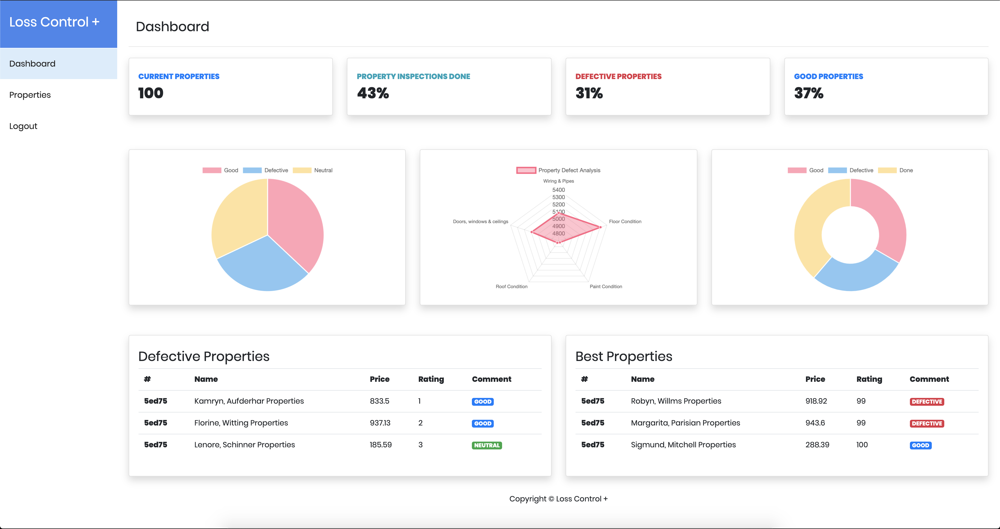
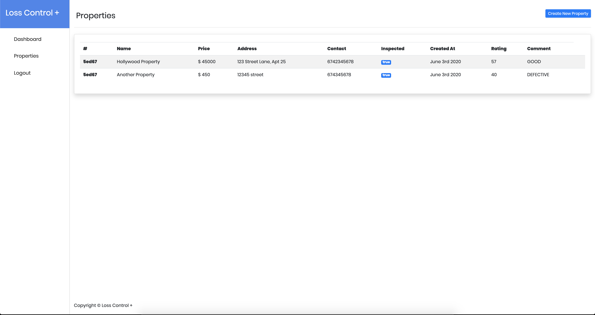
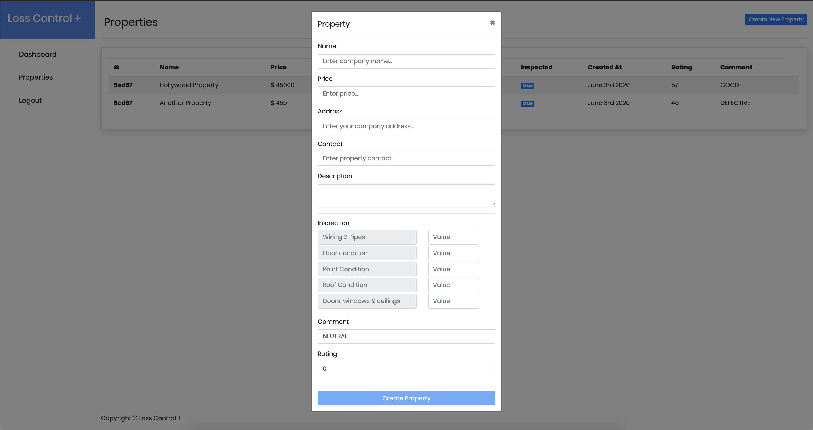

Insurance Inspection Application
========================================
Building an application which insurance companies can use for property inspections. 

The _back end_ for this application was done using the following technological stack:
* [NodeJS]() and [Express]()
* [Typescript]()
* [Jest]() for testing
* [Webpack]() for Hot-Module Replacement to significantly improve development times

The _front end_ is done using:
* [Angular 8]()
* [Jasmine]() and [Karma]() for testing

The _seeder_ is done using:
* [VanillaJS]()/[NodeJS]() for the seeder tool.
* [CommanderJS](https://github.com/tj/commander.js/) - elegant command line library for NodeJS
* [Faker.js](https://github.com/marak/Faker.js/) - generate massive amounts of realistic fake data in NodeJS and the browser

_Storage_
* [MongoDB]() for storage.

## Work Progress
* Worked mostly using TDD (switched due to time constraints). Had 2 branches; [develop]() and [master]()
* The master branch has the best version of the code and the develop branch has the most recent changes.
* List of commits and progress can be found [here](https://github.com/DanCarl857/web-developer-hiring-project/commits/develop)

## Features
* Basic authentication
* View properties
* Create properties
* Update properties
* Delete properties
* Dashboard analysing property and inspection data
* Seed tool to populate the MongoDB database
* Testing

## Development

#### Seeding the Database
You can generate test data for this application using the seeder tool I created.
From the root directory:
* `cd seeder`
* `npm install` to install dependencies
* `npm run seed-database`
* You should now see an email and a password in the terminal
* Those are your login credentials
* You can close the terminal and proceed to run the backend and frontend

#### Backend and Frontend
* Clone repository and from the root directory;
* Install dependencies using: `cd insurance-client-app && npm install` 
* To run the web application: `ng serve`
* Install dependencies using: `cd insurance-server && npm install` 

If you want to have HMR during development:

* To use Hot Module Replacement: `npm run webpack` 
* And in another terminal run `npm run dev` to run the server (_you must have run the previous command at least once for this step to work_).

And if you don't want to have HMR:

* `npm run start`

* Web app will be accessible in the browser at: [localhost:4200](http://localhost:4200)
* Server will be running on port [7001]()

#### Docker
```
docker-compose up
```

For development, the `insurance-server/` and `insurance-client-app/` directories have their own docker containers, which are configured via the `docker-compose.yml` file.

The webapp is spun up at `localhost:4200`

The local directories are mounted into the containers, so changes will reflect immediately. However, changes to package.json will likely need to a rebuild: `docker-compose down && docker-compose build && docker-compose up`.


## Difficulties
* Project was bigger than I expected

## Future Work
* Increase test coverage
* Setup CI/CD pipelines
* Improve error reporting and handling in both the webapp and API
* Work on data validation

## Demo
Below are some screenshots of the application:

### Login


### Signup


### Dashboard


### Properties


### Create Property
