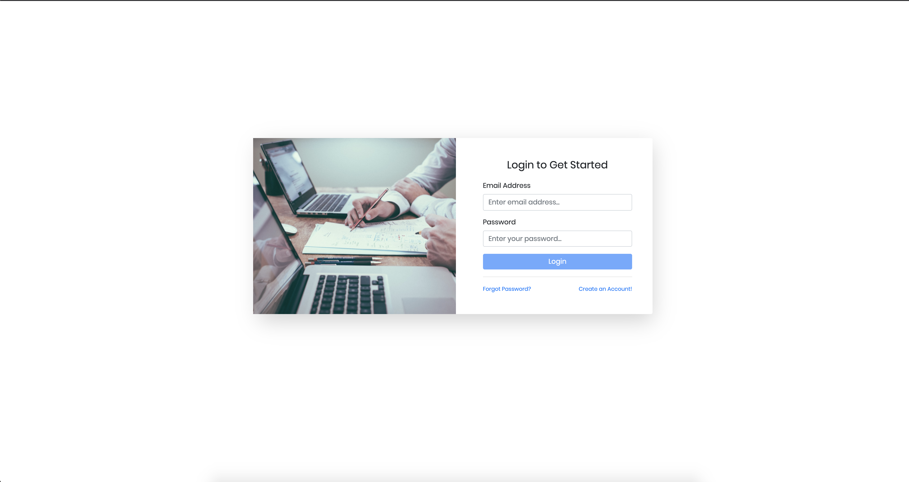

Insurance Inspection Application
========================================
Building an application which insurance companies can use for property inspections. 

The _back end_ for this application was done using the following technological stack:
* [NodeJS]() and [Express]()
* [Typescript]()
* [Jest]() for testing
* [Webpack]() for Hot-Module Replacement to significantly improve development times

The _front end_ is done using:
* [Angular 8]()
* [Jasmine]() and [Karma]() for testing

The _seeder_ is done using:
* [VanillaJS]()/[NodeJS]() for the seeder tool.

_Storage_
* [MongoDB]() for storage.

## Work Progress
* Worked mostly using TDD (switched due to time constraints). Had 2 branches; [develop]() and [master]()
* The master branch has the best version of the code and the develop branch has the most recent changes.
* List of commits and progress can be found [here](https://github.com/DanCarl857/web-developer-hiring-project/commits/develop)

## Features
* Basic authentication
* View properties
* Create properties
* Update properties
* Delete properties
* Dashboard analysing property and inspection data
* Seed tool to populate the MongoDB database
* Testing

## Development

#### Seeding the Database

#### Backend and Frontend
* Clone repository
* Install dependencies using: `cd insurance-client-app && ng start` to run the web application
* Install dependencies using: `cd insurance-server && npm run webpack` and in another terminal run `npm run start` to run the server.
* Web app will be accessible in the browser at: [localhost:4200](http://localhost:4200)

## Difficulties
* Project was bigger than I expected

## Future Work
* Increase test coverage
* Setup CI/CD pipelines
* Improve error reporting and handling in both the webapp and API
* Make use of async/await in server code to make things a bit cleaner.
* Work on data validation

## Demo
Below are some screenshots of the application:

Login

Signup

Dashboard

Properties

Create Property
